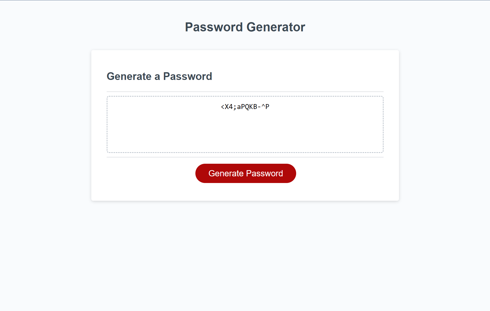

# Password Generator

The purpose of this application is to generate a random password based on criteria that the user has selected. 

## Usage

User follows the prompts and is guided through the password generation process, allowing customization of preferred criteria.

## Screenshots

## Link
(<https://parkercf.github.io/Password-Generator/>)

## Features

- prompts for password length
- prompts for uppercase letters
- prompts for lowercase letters
- prompts for symbols/special characters
- does not allow user to create a password outside of these parameters

## License

[MIT](https://choosealicense.com/licenses/mit/)

